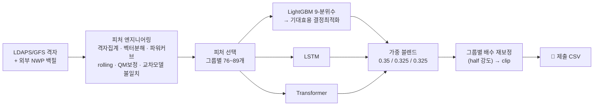
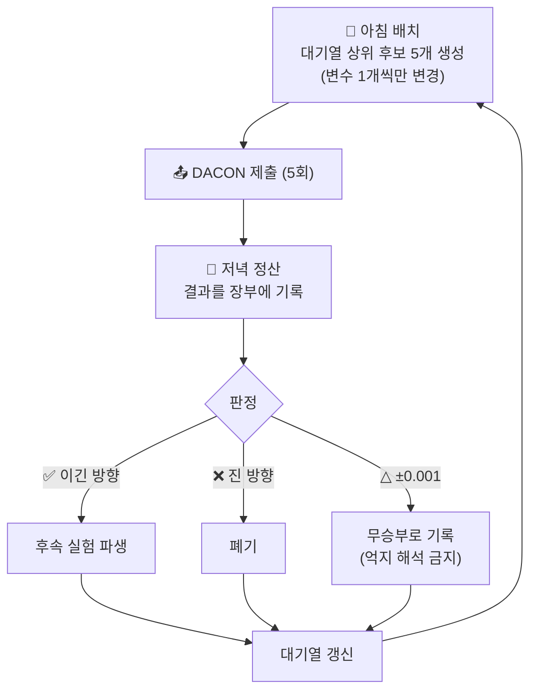

# 🌬️ BARAM 2026 — 풍력발전량 예측 AI

기상예보(NWP)와 터빈 SCADA 데이터로 3개 풍력단지의 **시간 단위 발전량(kWh)** 을 예측하는 DACON 경진대회 참가 프로젝트입니다.

리더보드 점수 **0.6091 → 0.63330**, 33회 제출의 성공과 실패를 전부 기록으로 남겼습니다.


---

## 📖 소개

풍력발전은 바람이 부는 만큼만 전기를 만듭니다. 전력시장(KPX)은 발전량을 **정확히 예측하는 사업자에게 정산금을 더 주는** 제도를 운영하고, 이 대회는 그 구조를 그대로 평가 지표로 옮겼습니다.

> **최종 점수 = 0.5 × (1-NMAE) + 0.5 × FICR**
> FICR(정산금획득률)은 시간대별 오차율이 6% 이하면 4원/kWh, 6~8%면 3원/kWh, **8%를 넘으면 0원**인 계단식 지표입니다. 평균 오차를 줄이는 것과, 각 시간대를 문턱 안쪽으로 밀어 넣는 것은 완전히 다른 문제 — 이 구조가 프로젝트의 모든 설계를 결정했습니다.

- 🎯 예측 대상: 3개 KPX 그룹(21.6 / 21.6 / 21.0 MW)의 2025년 한 해, 시간당 발전량 8,760행
- 📊 입력: LDAPS(1.5km)·GFS(0.25°) 기상예보 격자 + 터빈 SCADA(학습 기간만)
- 🔒 제약: 로컬 실행 모델만 허용, 1일 제출 5회
- 📚 **전 과정 자습 슬라이드(58장)**: [reports/review/baram2026_review.pptx](reports/review/baram2026_review.pptx) — 팩트체크 리포트([ppt_review.md](reports/review/ppt_review.md))까지 포함

---

## ✨ 핵심 아이디어

| 아이디어 | 요약 |
|---|---|
| 🎲 분포 예측 + 결정최적화 | 점예측 대신 9-분위수를 뽑고, FICR 단가표에 대한 기대 정산금을 최대화하는 값을 선택 |
| 🧱 발표묶음 시계열 CV | 같은 발표 시각을 공유하는 24시간을 한 블록으로 묶어 분할 — 리키지 원천 차단 |
| 🛰️ 외부 NWP 백필 | ECMWF·GEM 등을 리키지-세이프 오프셋으로 추가 — 후반 최대 도약(+0.0028) |
| 🧪 하루 5제출 = 5실험 | CV가 못 가르는 ±0.002를 리더보드 자체로 판정하는 프로브 운영 |

> 각 아이디어의 상세 수치·근거는 [reports/experiment_queue.md](reports/experiment_queue.md)(전체 실험 장부)에 있습니다.

### 🎲 1. 점예측이 아니라 분포 예측

LightGBM으로 분위수 9개(5%~95%)를 학습하고, FICR의 계단 단가표에 대해 **기대 정산금이 최대가 되는 제출값**을 후처리로 선택합니다 (`src/features/decision_optimize.py`).

- 💡 오차가 8%를 넘길 바에는, 확신 있는 쪽으로 "베팅"하는 값이 기대값상 유리합니다
- 단독 효과 **+0.0035** — 프로젝트 첫 번째 도약

### 🧱 2. 발표묶음 단위 시계열 CV

예보는 "전날 09시 발표분을 13시부터 사용"하는 식으로 도착합니다. 같은 `data_available_kst_dtm`을 공유하는 24시간이 한 "발표 묶음"이고, CV는 반드시 이 묶음 단위로 시간축을 끊습니다 (`src/validation/`).

- ⚠️ 원본 데이터에는 리키지가 없습니다 — 리키지는 **우리가 만드는 분할**에서 생깁니다
- rolling 통계도 발표묶음 경계를 넘지 않도록 구현, 단위 테스트로 고정 (`tests/`)

### 🛰️ 3. 외부 NWP를 리키지-세이프로 추가

Open-Meteo Previous Runs API의 `previous_day2` 오프셋을 쓰면, 대회 정보 컷오프(D-1 14:00 KST) 이전에 배포 완료된 예보만 쓴다는 것을 **산술적으로 증명**할 수 있습니다 (`src/data/fetch_ecmwf.py` 등 + 검증 테스트).

- ECMWF(0.25°): g1 한정 +0.0022 → 전그룹 **+0.0028 신기록**
- GEM(0.15°, 80m 허브고도 풍속)·JMA(전 기간 커버)·ICON까지 총 4개 소스 시도 — 결과는 아래 실패 장부 참고

### 🧪 4. 리더보드를 실험 장치로

종반에는 CV가 ±0.002 차이를 가르지 못했습니다. 그래서 **변수 1개만 바꾼 후보 5개를 매일 제출**하고, 저녁에 결과를 장부에 정산해 다음 날 대기열을 갱신하는 프로토콜로 전환했습니다.

- ⚙️ 판정 규율: ±0.001은 "무승부"로 기록, 억지 해석 금지
- 재학습 없이 기존 제출 CSV에서 블렌드 성분을 역산해 프로브를 만드는 스왑 산술도 이때 개발

---

## 📈 점수 여정 (Public 리더보드)

| 날짜 | 시도 | 점수 | Δ |
|---|---|---|---|
| 07-22 | LightGBM 단독 (튜닝+피처선택) | 0.6091 | 기준점 |
| 07-23 | 9-분위수 GBM + 결정최적화 | 0.6126 | +0.0035 |
| 07-23 | GBM/LSTM/Transformer 블렌드 | 0.6227 | +0.0101 |
| 07-24 | 배수 재보정 (half 강도) | 0.6280 | +0.0053 |
| 08-07 | ECMWF 피처 (g1 한정) | 0.6302 | +0.0022 |
| 08-11 | ECMWF 전그룹 | 0.6330 | +0.0028 |
| 08-12 | GBM 블렌드 가중 0.30→0.35 | 0.63325 | +0.0003 |
| 08-13 | 재보정 강도 0.5→0.45 | **0.63330** | +0.0001 |

---

## 💥 실패도 기록입니다

> 전체 장부는 [experiment_queue.md](reports/experiment_queue.md) — 아래는 하이라이트입니다.

| 사건 | 무슨 일이 | 교훈 |
|---|---|---|
| 🔄 ECMWF 사건 | CV는 g2에서 -0.0229 "해로움" 경고 → 리더보드에선 **신기록** | 피처 커버리지가 학습 기간의 일부뿐이면 CV는 눈이 먼다. "부분 커버리지는 리더보드로 판정"을 룰로 채택 |
| 📉 top3avg 사건 | 동률 제출 3개를 평균 → 1-NMAE 무사한데 FICR 붕괴(-0.0022) | 평균(스무딩)은 시간대별 오차를 문턱 밖으로 밀어냄. 계단식 지표에서 앙상블 상식은 통하지 않는다 |
| 💣 NN에 ECMWF 주입 | LSTM/Transformer 3그룹 전부 붕괴(최대 -0.041) | 트리는 결측·희소 피처를 분기에서 무시하지만, 소형 NN은 못 한다. 같은 피처, 다른 모델 계열, 정반대 결과 |
| 🚫 ICON / JMA 기각 | ICON은 g1 악화(-0.0067), JMA는 종합 중립 | "새 NWP 추가"가 만능이 아님. 특히 JMA는 전 기간 커버 = CV 신뢰 가능이라 위 룰을 적용하지 않고 정직하게 기각 |
| 🤏 그 외 | 19-분위수, 월별 재보정, 시드 배깅, 재보정 강도 0.6 … | CV 개선이 실전으로 전이되지 않는 경우가 흔하다 — 그래서 프로브 운영이 필요했다 |

---

## 🛠 기술 스택

| 구분 | 기술 |
|---|---|
| 언어 | Python 3.13 |
| 부스팅 | LightGBM (9-분위수), XGBoost·CatBoost (탐색 단계) |
| 딥러닝 | PyTorch — LSTM, Transformer (CUDA) |
| 데이터 | pandas, pyarrow (parquet), NumPy |
| 튜닝 | Optuna |
| 외부 데이터 | Open-Meteo Previous Runs API (ECMWF/ICON/GEM/JMA) |

---

## 🏗 파이프라인



## 🔄 일일 실험 사이클



---

## 📁 프로젝트 구조

```
├── src/
│   ├── data/          # 원본 로더 + 외부 NWP 백필 (fetch_ecmwf/gem/jma/icon.py)
│   ├── features/      # 피처 엔지니어링, quantile mapping, 결정최적화
│   ├── validation/    # 발표묶음 단위 시계열 CV 분할기
│   ├── models/        # LightGBM 분위수 / LSTM / Transformer 래퍼
│   ├── training/      # 학습 스크립트 (실험별 experiments/<run_id>/ 기록)
│   ├── evaluation/    # 1-NMAE / FICR 공식 산식 구현
│   └── inference/     # test 예측 → 제출 CSV
├── tests/             # 리키지 방지 로직·피처 함수 단위 테스트
├── reports/
│   ├── experiment_queue.md   # ⭐ 모든 실험의 대기열·프로토콜·결과 장부
│   ├── review/               # 리뷰 슬라이드(58장) + 팩트체크 리포트
│   ├── pipeline_explained.md # 파이프라인 상세 해설
│   ├── eda/                  # EDA 리포트 (SCADA 함정, 라벨 gap 등)
│   └── domain_research/      # 평가 산식·파워커브·웨이크 효과 조사
└── CLAUDE.md          # 프로젝트 규칙·도메인 지식·에이전트 팀 구성
```

---

## 🚀 로컬 실행

### 1. 환경 구성

```bash
conda env create -f environment.yml
conda activate baram2026
```

### 2. 파이프라인 실행

```bash
python -m src.features.build_features        # 피처 테이블 생성
python -m src.training.train_gbm_quantile    # GBM 학습 (experiments/에 기록)
python -m src.inference.predict <run_id>     # 제출 CSV 생성
```

> ⚠️ 원본 대회 데이터는 리포지토리에 포함되지 않습니다 — 로컬 경로는 [configs/paths.py](configs/paths.py)에서 설정합니다. 외부 NWP는 `python -m src.data.fetch_ecmwf` 등으로 다시 백필할 수 있습니다.

---

## 👤 Author

**zizonpubao** — [GitHub](https://github.com/zizonpubao)

> 이 프로젝트는 ML 학습을 목적으로 진행했으며, 개발 과정에서 Claude Code를 코드 작성 보조 도구로 활용했습니다 (예측 파이프라인은 전부 로컬 실행 모델 — 대회 규정 준수).
